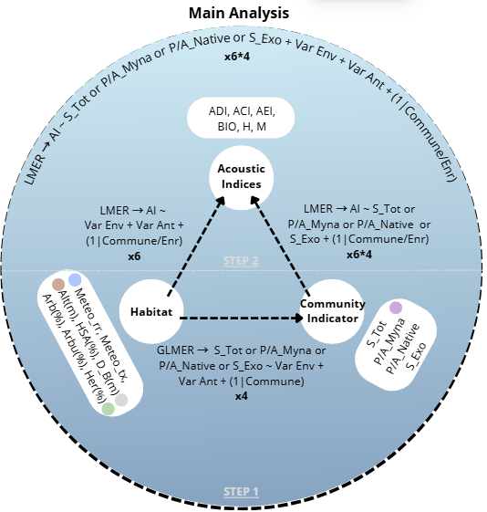

```{r}
#| label: Options
### Customized R options for this document
# Delete this chunk if you don't use R

# Necessary packages. Add all packages used in the code here.
packages_required <- c(
  # R tools, do not modify
  "knitr",
  # Add specific packages here
  "divent",
  "tidyverse", 
  "vegan"
)
# Already installed?
packages_installed <- vapply(
  packages_required, 
  FUN = requireNamespace, 
  FUN.VALUE = TRUE, 
  quietly = TRUE
) 
# Install missing packages
install.packages(names(packages_installed)[!packages_installed])

# Allow size='small' or any valid Latex font size in chunk options
def.chunk.hook <- knitr::knit_hooks$get("chunk")
knitr::knit_hooks$set(
  chunk = function(x, options) {
    x <- def.chunk.hook(x, options)
    ifelse(
      options$size == "normalsize", 
      yes = x,
      no = paste0("\n \\", options$size, "\n\n", x, "\n\n \\normalsize")
    )
  }
)

# knitr options (https://yihui.org/knitr/options/)
knitr::opts_chunk$set(
  # Code chunk automatic format if tidy is TRUE
  tidy = TRUE, 
  # Tidy code options: remove blank lines and cut lines after 50 characters
  tidy.opts = list(blank = FALSE, width.cutoff = 50),
  # Font size in PDF output
  size = "scriptsize", 
  # Select PDF figures in PDF output if PDF file exists beside PNG file
  knitr.graphics.auto_pdf = TRUE
)
# Text width of R functions output
options(width = 50)

# ggplot style
library("tidyverse")
# Function to call in each chunk that produces a figure
ggtheme_set <- function() {
  theme_set(theme_bw())
  theme_update(
    panel.background = element_rect(fill = "transparent", colour = NA),
    plot.background = element_rect(fill = "transparent", colour = NA)
  )
}
knitr::opts_chunk$set(dev.args = list(bg = "transparent"))

# Random seed
set.seed(973)
```

# Introduction

La question de la diversité des forêts tropicales fascine les écologues parce qu'elle a des enjeux très importants [@Gibson2011].
est qu'elle est difficile à comprendre [@Wright2002b].

A l'heure des menaces sur la biodiversité [@Fadrique2026], une connaissance plus détaillée de la diversité des forêts très étudiées est utile.

Des modèles ont été publiés [@Liang2022].

Comparer la diversité de Paracou [@Gourlet-Fleury2004] et de BCI [@Raby2017].

# Matériels et Méthodes

Nombre de Hill [@hill1973]

- Site de Paracou Comparer la diversité de Paracou [@Gourlet-Fleury2004] et de BCI [@Raby2017].
- Site de BCI
- Les analyses sont réalisées avec R [@R] et le package divent [@Marcon2026a].

```{r}
#| label: Paracou_BCI
library("tidyverse")
paracou6 <- read_csv2("data/Paracou6.csv")
library("vegan")
data(BCI)
library("divent")
BCI %>% 
  # Création d'un objet "abundances"
  as_abundances() %>% 
  # Les poids des parcelles sont égaux
  mutate(weight = 1) %>% 
  # Regrouper toutes les parcelles
  metacommunity() ->
  BCI_50ha
```

- Site Selection

The sites and data used in this study comes from the work of Emma Pilleboue, who installed temporary acoustic recording unit (ARU) throughout her internship.
After installation, the ARU recorded continuously during a period of several days varying between one full day and five full days, between the 15/02/2024 and 02/05/2024.

In totals, 51 sites of Emma’s work are used for this study.
The ARU were located at a minimal distance of approximately 200 meters and were in place following altitudinal or urban gradients in some cases.
They were also classified into four main habitat type : Urban (4), Suburban (15), Rural (6), Forest(26).
The habitats site are mostly forested landscapes or suburban areas, Urban and rural areas are less represented in the site selection.

::: {#fig-gradient}
```{r}
library(readxl)
Data_Globale_Tahiti <- read_excel("data/Excel_DataBrut/Data_Globale_Tahiti.xlsx")
#| label: gradient
# On crée un index numérique pour l’axe x
Data_Globale_Tahiti <- Data_Globale_Tahiti %>%
  mutate(x_id = as.numeric(factor(Enr)))

# Dataset pour les rectangles de fond
communes_bg <- Data_Globale_Tahiti %>%
  group_by(Commune) %>%
  summarise(
    xmin = min(x_id) - 0.5,
    xmax = max(x_id) + 0.5
  )
# Coefficient pour mettre l'altitude à l'échelle des HSA
coef_alt <- max(Data_Globale_Tahiti$`HSA`, na.rm = TRUE) /
            max(Data_Globale_Tahiti$`Alt`, na.rm = TRUE)

ggplot() +
  # Fond coloré discret
  geom_rect(data = communes_bg,
            aes(xmin = xmin, xmax = xmax,
                ymin = -Inf, ymax = Inf,
                fill = Commune),
            alpha = 0.08) +
  
  # Barres HSA
  geom_col(data = Data_Globale_Tahiti,
           aes(x = x_id, y = `HSA`),
           fill = "grey40") +
  
  # Points altitude (mis à l’échelle)
  geom_point(data = Data_Globale_Tahiti,
             aes(x = x_id, y = `Alt` * coef_alt),
             shape = 4,              # croix
             color = "#E5989B",      # rouge pastel doux
             size = 2,
             stroke = 0.8,
             alpha = 0.8) +
  
  scale_x_continuous(
    breaks = Data_Globale_Tahiti$x_id,
    labels = Data_Globale_Tahiti$Enr
  ) +
  geom_line(data = Data_Globale_Tahiti,
          aes(x = x_id, y = `Alt`* coef_alt, group = 1),
          color = "#E5989B",
          linewidth = 0.7) +
  
  scale_y_continuous(
    name = "Hard Surface Area (%)",
    sec.axis = sec_axis(~ . / coef_alt,
                        name = "Altitude (m)")
  ) +
  
  scale_fill_brewer(palette = "Paired") +
  
  labs(x = "Site",
       caption = "Gradient site") +
  
  theme_minimal() +
    theme(legend.position = "none") +
  theme(axis.text.x = element_text(angle = 45, hjust = 1))
```
Gradient d'HardSurfaceArea (%) et d'Altitude (m) en fonction des sites étudiés
:::

Acoustic indices selection for better description and tests, use the website to have basic indices described [here](https://ecohack.shinyapps.io/Acoustic_Index_Users_Guide/) [@bradfer-lawrence2025]


::: {fig-indice}
```{r}
#|label: indice
knitr::include_graphics("images/Capture d'écran 2026-08-18 161213.png")
```

Pattern expectation of selected indices [@sánchez-giraldo2021]
:::

- Analysis framework intended

::: {#fig-framework}
```{r}
#| label: framework

```

Schéma d'analyse visé
:::

# Résultats

::: {#fig-compa}
```{r}
#| label: compa
#| out-width: 50%
paracou6 %>% 
  # Vecteur des noms d'espèce de chaque arbre
  pull(spName) %>% 
  # Création d'un objet "abundances"
  as_abundances() %>% 
  # Ajout des données de BCI
  bind_rows(BCI_50ha) %>% 
  # Remplacement des NA par 0
  mutate(across(everything(), ~ replace_na(.x, 0))) %>% 
  # Nom des sites
  mutate(site = c("Paracou", "BCI")) %>% 
  # Profil de diversité avec enveloppe de confiance
  profile_hill(n_simulations = 2) %>% 
  # Figure
  autoplot() +
  # Titre de la légende
  labs(color = "Forêt", linetype = "Forêt")
```

Différence de valeurs de diversité en fonction de son ordre entre les sites de Paracou et BCI
:::

# Discussion

@MacArthur1967 montrent mathématiquement que la richesse spécifique (le nombre d'espèces) d'une île est un équilibre dynamique entre le taux d'immigration et le taux d'extinction, ce dernier étant directement dicté par la taille de l'île.

BCI est une forêt secondarisée [@Raby2017].
Sa diversité pourrait être augmentée selon la théorie de la perturbation intermédiaire [@Connell1978].

Bonus sur la thématique Tahiti_Soundscape

```{r}
#| label: Tahiti
library(readxl)
Data_Globale_Tahiti <- read_excel("data/Excel_DataBrut/Data_Globale_Tahiti.xlsx")
```
